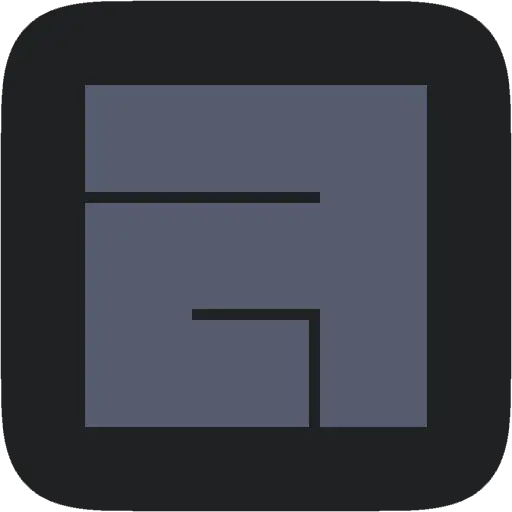

<h1 align="center">Heyo!! I'm Emi! 👋</h1>

<h3 align="center">Backend Witch, Container Summoner, Frontend Luminary</h3>

  

Computer Poker by trade, Software Developer by heart. 
<samp>(Official Job Title: **Test Technician**, but that sounds boring 🙄)</samp>

<blockquote>“Through breakdowns to breakthroughs.”</blockquote>
<blockquote>“Don't care if you think it's cringe because it's not your life!”</blockquote>

## What Am I Up To?
- 📺 Making a unit tracking solution for the packing department of the company I work for!
- 🔺 Building a Developer API to keep track of Geometry Dash players and their endeavours!
- 🐭 Learning Go to level up my scaling abilities!

## Side Projects
- ✍️ [skebap](https://github.com/Aproxia-dev/skebap) - An extremely simple Pastebin clone. Built as a graduation project. 🎓
- 🌺 [overgrown](https://github.com/overgrown-hibiscus) - A suite of software configurations made to be flexible and beautiful.
- ❄️ [nixos-config](https://github.com/OwO-digital/nixos-config) - A desktop NixOS configuration made to be shared across several devices with my partner.

## Hit Me Up!
 

  
   
   
   
   
   
  

## Extras

<b>More Stack Details</b>

    <h3>Minor Experience With:</h3>
        
    <h3>Currently Learning:</h3>
        
    <h3>Interested in:</h3>
        
    <h3>My Work Environment:</h3>
        
        
        
        </a>
        
        
        

<b>Fun Facts</b>

    
- I've been fascinated by computers ever since I can remember.
  - As much as I've grown rusty over the years, I am no stranger to multimedia either! 🎥
  - I have fond memories of setting up really cool Minecraft servers when I was barely 11! 🛠️
- I like music a lot, especially experimental music. 🎶
- I used to be pretty good at Beat Saber! ⚔️
- I built and soldered my own keyboard! ⌨️
  - It's a Lily58, an ergonomic split keyboard!
  - Built with Gateron Box Ink Pinks v2s and DSA Astrolokeys! ✨
- My favorite animals are foxes! 🦊

<b>GitHub Stats</b>

  
  
  
  

---
 
<picture>
  <source media="(prefers-color-scheme: dark)" srcset="https://raw.githubusercontent.com/Aproxia-dev/Aproxia-dev/output/snake-dark.svg" />
  <source media="(prefers-color-scheme: light)" srcset="https://raw.githubusercontent.com/Aproxia-dev/Aproxia-dev/output/snake-light.svg" />
  
</picture>

